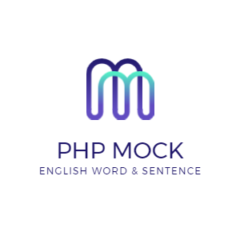
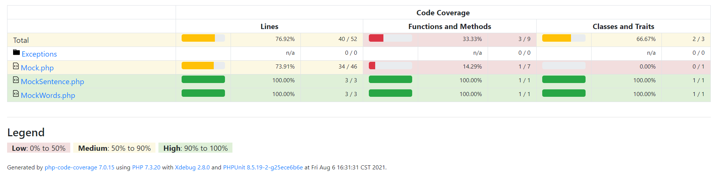

<div align=center>
  
  
  
</div>


[中文文档](./REDEME-ZH.md)

#### Introduction


> This library provides the generation of English words and sentences, it supports custom thesaurus, supports custom return word\sentence length and return type (string, array, object, json), it will not be due to a custom large file thesaurus Cause your memory is not enough, lightweight and fast to help you generate data.


#### Install

```shell
composer require kayw-geek/php-mock -vvv
```

#### Use

```php
//Mock single word
$mockWord = new \KaywGeek\MockWords();
$mockWord->mockWord();
//Mock sigle sentence
$mockSentence = new \KaywGeek\MockSentence();
$mockSentence->mockWord();

//Mock specify the number of words in the specified format
//Parameter 1 The specified format that you want to return
/**
  * FORMAT_ARRAY;
  * FORMAT_OBJECT;
  * FORMAT_JSON;
  * FORMAT_STRING; 
  */
//Parameter 2 The length you want to return
$mockWord->mockWords(\KaywGeek\MockWords::FORMAT_ARRAY,5);
$mockSentence->mockWords(\KaywGeek\MockWords::FORMAT_JSON,6);

//自Custom thesaurus usage
$filePath = 'custom-words.txt';
$mockSentence = new \KaywGeek\MockSentence($filePath);
```


#### Test coverage



